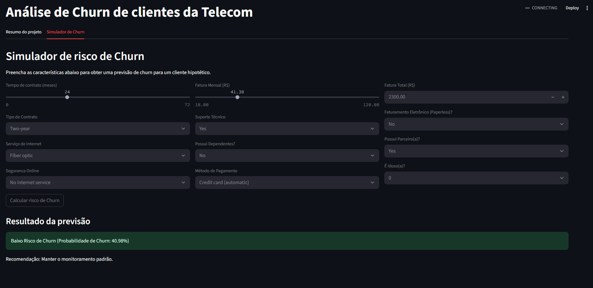

# 📊 Análise de Churn e Modelo Preditivo com Dashboard Interativo

**Status do Projeto:** Concluído ✔️


---

### Contexto do Projeto

Este projeto de portfólio aborda um desafio de negócio crítico: a **perda de clientes (Churn)** em uma empresa de telecomunicações. Com uma taxa de churn de aproximadamente 26.5%, a empresa enfrenta uma perda significativa de receita. O objetivo deste projeto foi analisar os dados para entender os principais fatores que levam ao cancelamento e, em seguida, construir um modelo de Machine Learning para prever quais clientes estão em risco, permitindo ações de retenção proativas.

---

### 📂 Estrutura do Projeto
O projeto está organizado da seguinte forma:
- `app.py`: O script do dashboard interativo feito com Streamlit.
- `notebooks/01-exploracao_inicial.ipynb`: O Jupyter Notebook contendo toda a análise exploratória, limpeza de dados, treinamento e avaliação dos modelos.
- `data/`: Contém o dataset original.
- `modelo_campeao.pkl`, `scaler.pkl`, `features.csv`: Artefatos do modelo e dos dados, gerados pelo notebook para serem consumidos pelo app.
- `requirements.txt`: Lista de dependências do Python para reprodução do ambiente.

---

---

### 📥 Obtenção dos Dados

O dataset original utilizado neste projeto é o "Telco Customer Churn" e pode ser encontrado no Kaggle.

Para que o notebook de análise (`01-exploracao_inicial.ipynb`) funcione, o arquivo `WA_Fn-UseC_-Telco-Customer-Churn.csv` deve estar presente dentro da pasta `data/`.

Existem duas maneiras de obter os dados:

**Opção 1: Download Manual (Simples)**
1. Acesse o link do dataset no Kaggle: [Telco Customer Churn](https://www.kaggle.com/datasets/blastchar/telco-customer-churn)
2. Clique no botão "Download".
3. Descompacte o arquivo `.zip` baixado e mova o arquivo `WA_Fn-UseC_-Telco-Customer-Churn.csv` para a pasta `data/` do projeto.

**Opção 2: Download via API do Kaggle (Recomendado para reprodutibilidade)**
1. Caso ainda não tenha, instale a biblioteca do Kaggle: `pip install kaggle`.
2. Baixe seu token de API (`kaggle.json`) da seção 'Account' no seu perfil do Kaggle e coloque-o na pasta `C:\Users\<Seu-Usuario>\.kaggle\` (Windows) ou `~/.kaggle/` (macOS/Linux).
3. Execute o seguinte comando no terminal, a partir da pasta raiz do projeto:
   ```bash
   kaggle datasets download -d blastchar/telco-customer-churn -p data/ --unzip

### 💡 Principais Descobertas (Insights da Análise)

A análise exploratória revelou um perfil claro para o cliente com alto risco de churn:
- **Contrato e Faturamento:** Clientes com contrato **mês a mês** e que utilizam **cheque eletrônico** para pagamento apresentam as maiores taxas de churn.
- **Serviços:** A posse de internet de **Fibra Ótica**, combinada com a **ausência de serviços de proteção** (Suporte Técnico, Segurança Online, etc.), é um forte indicador de risco.
- **Perfil Numérico:** O risco é maior para clientes com **faturas mensais mais altas** e que estão há **pouco tempo** na empresa (baixo `tenure`).

---

### 🤖 Resultados do Modelo

Foram testados quatro algoritmos de classificação: Regressão Logística, Árvore de Decisão, Random Forest e XGBoost. O desempenho foi avaliado com base no F1-Score e Recall para a classe "Churn", pois o objetivo principal é identificar corretamente os clientes que irão cancelar.

**Tabela de Comparação de Modelos**

| Modelo                | Acurácia | F1-Score (Churn) | Recall (Churn) |
| :-------------------- | :------- | :--------------- | :------------- |
| Regressão Logística   | 0.79     | 0.56             | 0.52           |
| Random Forest         | 0.79     | 0.54             | 0.49           |
| XGBoost               | 0.78     | 0.54             | 0.51           |
| Árvore de Decisão     | 0.72     | 0.51             | 0.52           |

O modelo campeão foi a **Regressão Logística**, que, apesar de mais simples, apresentou o melhor F1-Score. Isso demonstra que nem sempre a solução mais complexa é a melhor e que um modelo interpretável pode ser altamente eficaz. O modelo final é capaz de identificar **52% de todos os clientes que realmente cancelariam**, fornecendo à empresa uma ferramenta valiosa para ações de retenção.

---

### 🚀 Como Executar o Projeto

1.  **Clone o repositório:**
    ```bash
    git clone https://github.com/AnnaElisaF/analise-churn-python.git
    cd analise-churn-python
    ```
2.  **Configure o Ambiente:**
    Crie um arquivo chamado `.env` na raiz do projeto, seguindo o exemplo do `.env.example`. Adicione a seguinte linha, substituindo o caminho pelo local onde você clonou o projeto no seu computador:
    ```
    PROJECT_PATH=C:\caminho\para\o\seu\projeto\analise-churn-python
    ```
3.  **Crie e ative um ambiente virtual:**
    ```bash
    python -m venv .venv
    # No Windows:
    .\.venv\Scripts\activate
    # No macOS/Linux:
    source .venv/bin/activate
    ```
4.  **Instale as dependências:**
    ```bash
    pip install -r requirements.txt
    ```
5.  **Execute o dashboard:**
    ```bash
    streamlit run app.py
    ```
    O dashboard estará disponível no seu navegador no endereço `http://localhost:8501`.

---

### 🎬 Demonstração do Dashboard

!

---

### Autor

**[Anna Elisa de Figueiredo Fior]**

* **LinkedIn:** [\[Link para o seu Perfil no LinkedIn\]](https://www.linkedin.com/in/anna-f-fior/)
* **GitHub:** [\[Link para o seu Perfil no GitHub\]](https://github.com/AnnaElisaF)